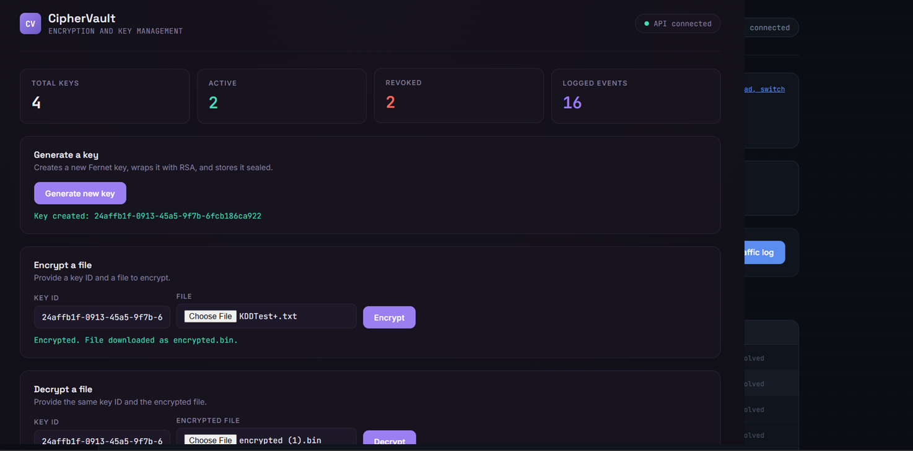

# CipherVault — Encryption & Key Management System

A full-stack encryption and key management system implementing envelope encryption, key revocation, and complete audit logging — the same core pattern used by cloud key management services like AWS KMS.

## What it does

CipherVault lets you generate encryption keys, use them to encrypt and decrypt files, and revoke a key at any time — after which it can no longer be used, even by someone who has the key ID. Every action (generate, encrypt, decrypt, revoke, and every denied attempt) is logged with a timestamp and reason, producing a complete audit trail.

## Tech stack

- **Backend:** Python, Flask, Flask-CORS
- **Cryptography:** Python `cryptography` library — Fernet (AES-128, authenticated) for file encryption, RSA-2048 with OAEP padding for key-wrapping
- **Database:** MySQL, via SQLAlchemy
- **Frontend:** HTML, CSS, vanilla JavaScript (no framework)

## Architecture: envelope encryption

Rather than storing encryption keys directly in the database, CipherVault uses **envelope encryption** (also called key-wrapping) — the same approach real key management systems use:

1. A **Fernet key** is generated to encrypt the actual file contents. Fernet provides AES-128 encryption with built-in integrity verification (it detects tampering and wrong-key attempts rather than silently returning garbage).
2. That Fernet key is itself encrypted ("wrapped") using an **RSA-2048 public key**, with OAEP padding.
3. Only the **wrapped** key is stored in the database. The raw Fernet key never touches disk.
4. When a file needs to be encrypted or decrypted, the wrapped key is retrieved and "unwrapped" using the RSA **private key** — but only after checking the key hasn't been revoked or expired.

This means a database breach alone does not expose usable encryption keys — an attacker would also need the RSA private key (the "master key"), which is kept out of source control entirely and would live in a secrets manager in a production deployment.

```
Fernet key (encrypts files)
      │
      ▼ wrapped with RSA public key
Wrapped key ──────────────► stored in MySQL
      │
      ▼ unwrapped with RSA private key
                              (only at time of use, only if not revoked/expired)
```

## Key lifecycle and access control

Every time a key is requested for use, the system checks, in order:
1. Does the key exist?
2. Has it been revoked?
3. Has it expired (if an expiry was set)?

Any failure returns a specific error and is logged as a `denied` event with the reason — this was verified directly: encrypting with a key, revoking it, and attempting to encrypt again with the same key correctly fails with `"Key has been revoked"` rather than silently succeeding or crashing.

## Audit logging

Every action against a key — `generate`, `encrypt`, `decrypt`, `revoke`, and `denied` (with a reason) — is recorded with a timestamp, forming a queryable history per key or across the whole system.

## API endpoints

| Endpoint | Method | Description |
|---|---|---|
| `/api/keys` | POST | Generate a new key |
| `/api/keys` | GET | List all keys and their status |
| `/api/keys/<id>/revoke` | POST | Revoke a key |
| `/api/encrypt` | POST | Encrypt a file with a given key (form-data: `key_id`, `file`) |
| `/api/decrypt` | POST | Decrypt a file with a given key (form-data: `key_id`, `file`) |
| `/api/logs` | GET | Fetch the audit trail, optionally filtered by `?key_id=` |
| `/api/health` | GET | Health check |

## Setup

### Prerequisites
- Python 3.10+
- MySQL Server running locally

### Install and run

```bash
cd ciphervault
pip install -r requirements.txt

# generate the RSA master key pair (only needed once)
python generate_master_key.py

# create the database
mysql -u root -p -e "CREATE DATABASE ciphervault;"

# create a .env file in the project root with:
# MYSQL_PASSWORD=your_mysql_password

# create the tables
python models.py

# start the API
python app.py
```

The API runs at `http://127.0.0.1:5001`.

Open `frontend/index.html` directly in a browser to use the dashboard.

## Dashboard

The dashboard shows total/active/revoked key counts, panels to generate keys and encrypt/decrypt files, a keys table using a "seal" indicator (intact for active keys, broken for revoked ones), and a filterable audit log.



## Security notes and limitations

- `master_private_key.pem` and `.env` are excluded from version control. In a production system, the RSA private key would be held in a hardware security module or managed secrets service (e.g. AWS KMS, HashiCorp Vault), not a local file.
- This project demonstrates the envelope encryption *pattern* correctly, but is a local development setup, not a production-hardened deployment — Flask's development server is used, and there is no authentication layer on the API itself (any client that can reach the API can call any endpoint).
- Key expiry is supported in the data model but keys must currently be created with an explicit expiry timestamp via the API; the dashboard's "generate" button does not yet expose an expiry field.
